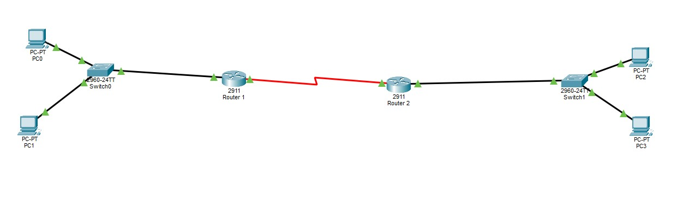
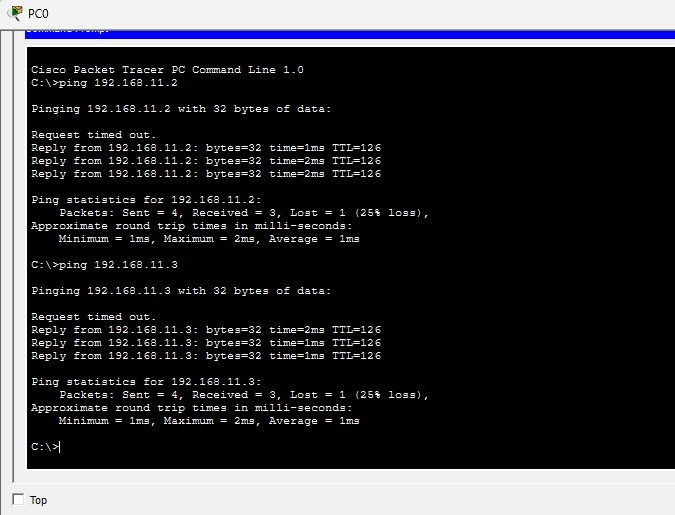

# RIP-Based Hybrid Enterprise Network Topology

This project demonstrates a dynamic routing configuration using **Routing Information Protocol (RIPv2)** within Cisco Packet Tracer. The topology connects two distinct Local Area Networks (LANs) via a Serial WAN link, ensuring seamless end-to-end connectivity between multiple end devices.

## 🚀 Overview
The primary goal of this lab was to implement dynamic routing to allow communication across different subnets. By using RIPv2, the routers automatically exchange routing tables and adapt to network changes.

### Key Features:
* **Dynamic Routing:** Configured RIPv2 with `no auto-summary` for precise subnet advertisement.
* **Network Segmentation:** Split into three subnets (LAN 1, WAN, and LAN 2).
* **Hardware:** Utilized Cisco 2911 Routers and 2960 Switches.

## 🛠️ Network Details
| Segment | Subnet | Gateway IP |
| :--- | :--- | :--- |
| **LAN 1 (Left)** | 192.168.10.0/24 | 192.168.10.1 |
| **WAN Link** | 10.0.0.0/30 | - |
| **LAN 2 (Right)** | 192.168.11.0/24 | 192.168.11.1 |

## ⚙️ Configuration Snippets
To enable RIP on the routers, the following commands were utilized:

```bash
router rip
 version 2
 no auto-summary
 network 10.0.0.0
 network 192.168.x.0
```

## 🖼️ Topology Diagram


## 📉 Connectivity Proof (Ping Test)


## 🎓 Skills Applied
* **Subnetting:** Design of Class C and VLSM-compatible networks.
* **Cisco IOS CLI:** Hands-on experience with router configuration modes.
* **Troubleshooting:** Resolving Layer 3 connectivity issues and interface status.
